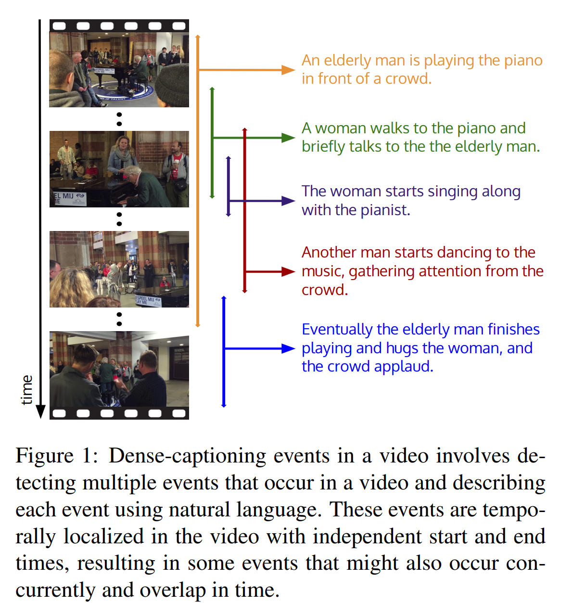
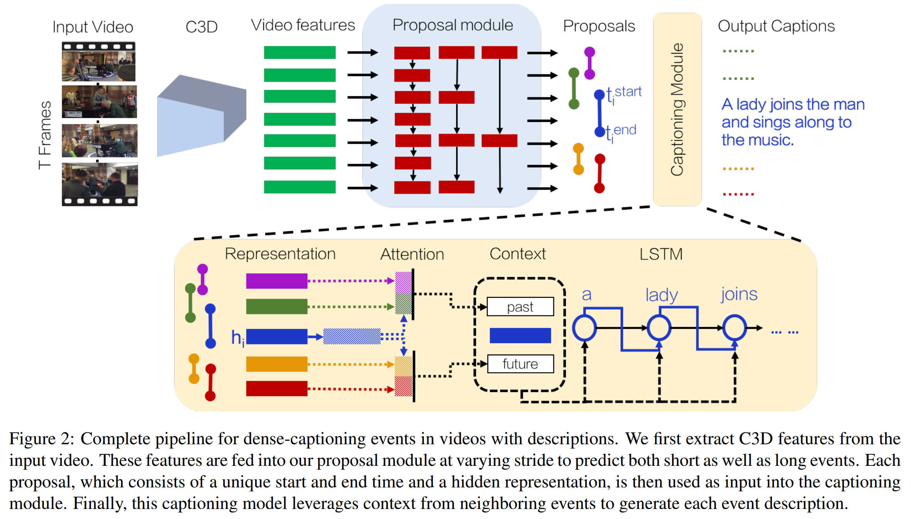
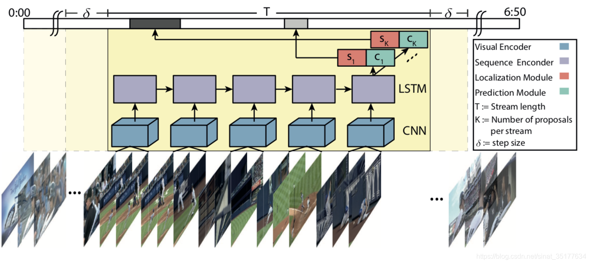

- *
{:toc}

# 前言

随着大规模动作数据集的引入，动作检测任务被提出并取得不错的性能。但是该任务存在一个局限性：缺乏细节。因此，后续工作探索使用句子描述来解释视频动作语义。在此基础上进一步提出了Dense video captioning（即识别视频中的所有事件并用自然语言描述它们），如图1所示。

本文是由李飞飞团队提出的Dense video captioning的开山之作。本文的贡献如下：

- 首次提出了dense-captioning events任务，它涉及检测和描述视频中的事件；

- 设计了一个新的模型，能够同时识别视频中的所有事件，并使用自然语言描述检测到的事件。

- 提出一种新的数据集：ActivityNet Captions。

# 方法概述

本文方法的整体框架图如图2所示，主要包括：proposal模块和captioning模块。我们首先结合Dense video captioning的研究挑战来简述每个模块的研究动机，然后再依次详细介绍各模块。

Dense video captioning的挑战是：

1）视频中的时间可以跨越多个时间尺度，甚至可以重叠。

    以前的方法：通过使用平均池化或循环神经网络对整个视频进行编码。这种方法适用与短视频，但对于跨越几分钟的长视频序列进行编码时会导致梯度消失，阻碍训练的成功。

    本文方法：引入一个proposal模块，将生成动作proposal的工作扩展为事件的多尺度检测，用来捕获视频中包含的短的、长的以及跨越几分钟的事件；

2）给定视频中的事件通常是相互关联的。因此模型必须能够使用周围事件的上下文来说明每个事件。

    本文方法：引入一个captioning模块，该模块利用proposal模块中所有事件的上下文来生成每个描述语句。

最后，为了评估我们的模型并对Dense video captioning进行基准测试，我们引入一个大规模的数据集：ActivityNet Captions。

    ActivityNet Captions数据集：包含从ActivityNet数据集中截取的20k个视频，其中每个视频都带有一系列时序定位描述；包含长达10分钟的视频，每个视频平均带有3.65句文本描述。这些描述指可能同时发生的事件没导致视频片段重叠。我们确保给定视频中每个描述都是唯一的，并且只涉及一个片段。数据集中的视频是以人类活动为中心，但描述也可能涉及非人类活动。

## 公式化定义

- 输入：一系列视频帧$v=\left \{v_{t}\right \}$,其中$t\in 0,\cdots ,T-1$表示按时间顺序的索引帧。

- 输出：一组描述语句$s_{i}\in S$，其中$s_{i}=\left ( t^{start},t^{end},\left \{v_{j}\right \}\right )$由每个句子的开始和结束时间组成，每个句子由一组词$v_{j}\in V$定义，每个词的长度不同，V表示词汇集。

本文模型首先将视频帧通过proposal模块生成一组proposals。

$P=\left \{\\left ( t_{i}^{start},t_{i}^{end},score_{i},h_{i}\right )right \}$

所有得分高于阈值的proposals都被输入到caption模块中，caption模块使用来自其他proposal的上下文事件，同时为每个事件配上文本描述。proposal模块输出的每个事件的隐藏表示$h_{i}$被用作caption模块的输入，然后caption模块同时利用其他事件的上下文来生成每个事件的描述。

## proposal模块

- 输入：利用C3D网络提取的视频特征序列：$\left \{f_{t}=F\left ( v_{t}:v_{t+\delta}\right )\right \}$。其中，F表示提取$\delta=16$帧的C3D特征。F的输出是一个大小为N×D的张量，其中D = 500维特征，N = T /δ离散视频帧。

- proposal模块：实际上是DAPs的变体。首先介绍一下DAPs模型：

    DAPs是2016年ECCV提出的一种用于temporal action proposals任务的方法。该任务根据长视频的动作语义信息在时间维度将长视频分割成多个segment，保证每个segment包含一个action。由于action segments的长度不同，在之前的方法中需要设置不同的滑动窗口多次扫描整个视频，再使用极大似然的方法找到最合适的segment，这种方法运行速度很慢。而DAPs只使用了一个滑窗就可以得到不同尺度的proposal，只对视频处理一遍因此速度是之前算法的10倍。它的具体模型如图3所示。

    对于输入的整个视频先使用C3D网络来提取视频特征，之后输入到LSTM网络来把这些特征串联起来，隐藏层$h$作为时序特征，再使用滑动窗口来扫描整个特征序列，得到预测的action segment并且对每个segment打分。至于如何用一个滑动窗口得到不同尺度的segment，文章使用了anchor机制，anchor的尺度使用k-means聚类来对实际的action segments处理，得到k种尺度的anchor，再得到不同尺度的segment。训练时的公式如下：

    $\left (x^{*},\theta ^{*}\right)=\underset{x,\theta}{argmin}\alpha L_{match}\left (x,S\left (\theta \right),A\right)+L_{conf}\left (x,C\left (\theta \right)\right)$

    s.t. $x_{i,j}\in \left \{0,1\right \},\sum_{i,j}x_{ij}=1$

本文的proposal模块：将输入特征使用DAPs来提取事件proposal。为了可以得到交叉重叠的segment，对视频特征使用不同的stride（分别为1、2、4和8）来采样输入到DAPs模型中，这样就得到了不同事件的proposal。

## caption模块

为了使用到上下文即其他segment的信息，本文caption模块首先使用了attention机制，对当前segment之前的segment特征加权得到一个past特征，再对当前segment之后的segment特征加权得到一个future特征，再和当前segment特征融合为一个整体特征，输入到LSTM网络中生成caption。在上下文的帮助下，每个LSTM拥有关于已经发生或将要发生的事件的知识，并可以相应地调整其生成的caption。

## 损失函数

本文使用两个独立的损失来训练proposal模块（$L_{prop}$）和caption模块（$L_{cap}$）。 proposal模块预测了不同proposal长度的置信度，范围在0到1之间。 本文使用一个加权的交叉熵项来评估每个proposal的置信度，只将那些与GT有很高的IoU的建议传递给caption模块。本文在每个句子的所有单词中使用交叉熵损失,通过语言模型中的批量大小和序列长度来规范损失。 本文用λ1=1.0来衡量caption损失的贡献，用λ2=0.1来衡量proposal损失的贡献：

$L=\lambda _{1}L_{cap}+\lambda _{2}L_{prop}$

# 总结
本文作为dense video caption任务的开山之作，详细的给出该任务的公式定义，提出了一种新的模型，并给出了用于该任务的大规模数据集，为后续工作建立了基准。本文是入门该方向的一篇重要论文，值得学习。
